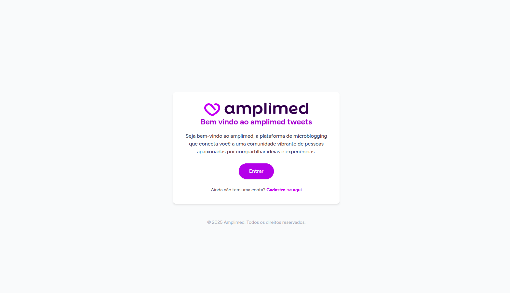
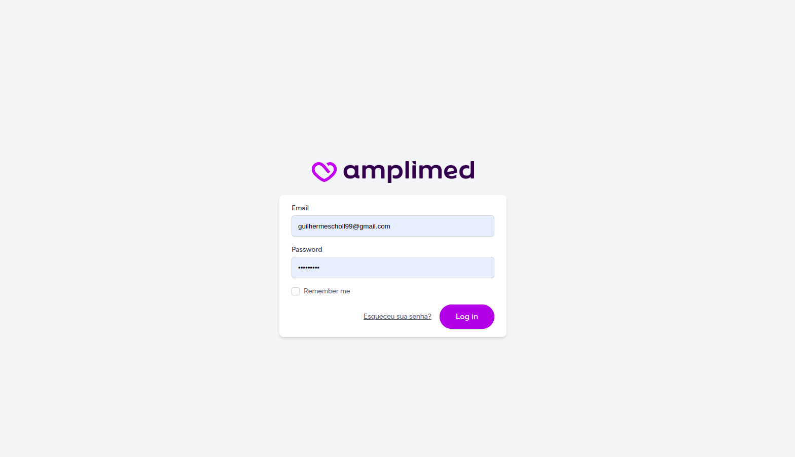
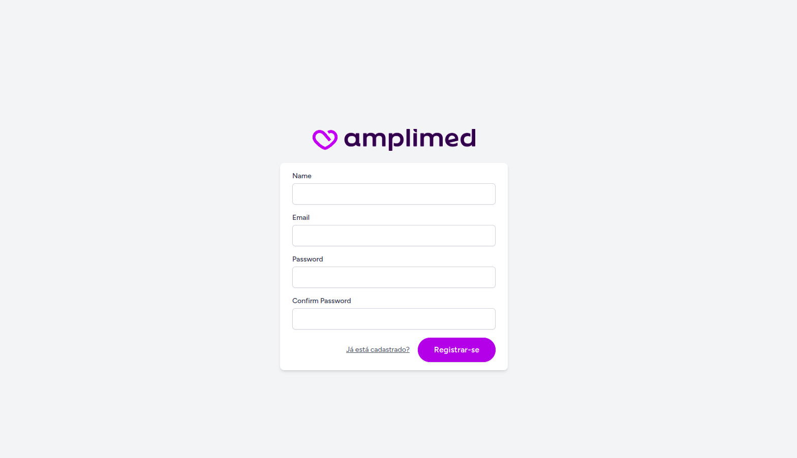
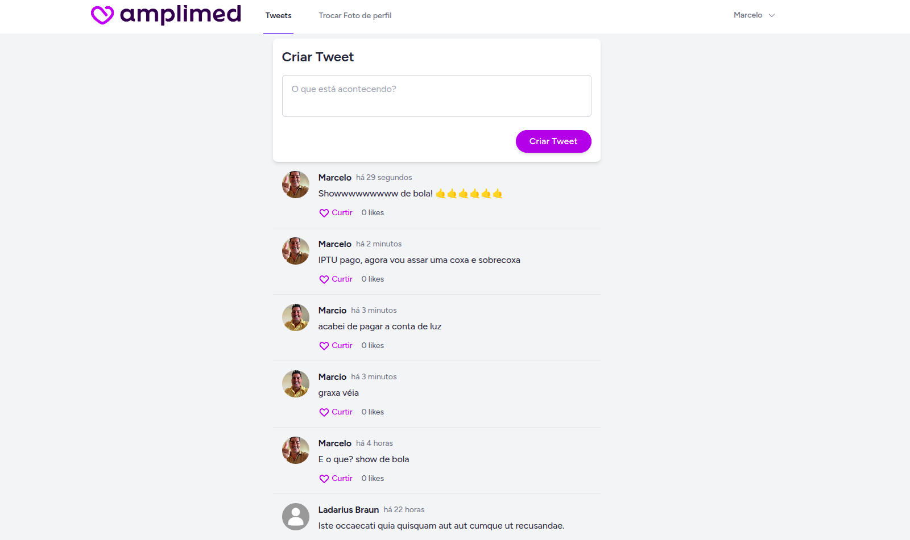
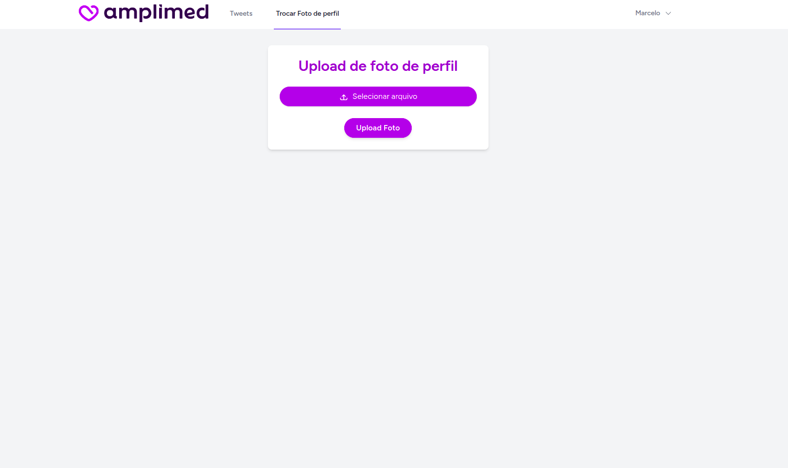

# Amplimed Tweets

**Amplimed Tweets** é uma aplicação web desenvolvida com [Laravel](https://laravel.com/), utilizando [Jetstream](https://jetstream.laravel.com/) e [Livewire](https://laravel-livewire.com/).
Este projeto foi desenvolvido com o intuito de entender um pouco melhor o mecanismo do livewire para aplicação em projetos secundários ou menores da amplimed que podem ser usados como monolito como por exemplo a funcionalidades de pré-protocolos utilizada na api de APS.
## 🚀 Tecnologias Utilizadas

- [Laravel] (https://laravel.com/)
- [Jetstream](https://jetstream.laravel.com/) com stack Livewire
- [Livewire](https://laravel-livewire.com/)
- [Tailwind CSS](https://tailwindcss.com/)
- [MySQL](https://www.mysql.com/)

## ⚙️ Instalação

1. Clone o repositório:

   ```bash
   git clone https://github.com/GuilhermeCScholl/live.git
   cd live
2. Instale as dependências do PHP e Tailwind Css:

   ```bash
   composer install
   npm install

3. Copie o .env de exemplo e para seu arquivo .env
   ```bash
   cp .env.example .env

4. Gere a chave de aplicação
    ```bash
    php artisan key:generate
    
5. Atualize as credências do banco no seu .env
    ```bash
    DB_CONNECTION=mysql
    DB_HOST=
    DB_PORT=3306
    DB_DATABASE=
    DB_USERNAME=
    DB_PASSWORD=
6. Crie seu DB para o projeto
7. Execute as migrations
    ```bash
    php artisan migrate
8. Faça o build de dev do seu npm para buildar as classes e estilos do Tailwind CSS
    ```bash
    npm run dev

9. Rode o servidor artisan do laravel (se caso tiver usando as portas de 8000 á 8019 é necessário declarar uma porta diretamente, por conta que o artisan procura da porta 8000 até 8010 e provavelmente todas já estão em uso pelo container)
    ```bash
    php artisan serve --port=8040
    
## Prints do sistema
<p align="center">
  
</p>
<p align="center">
  
</p>
<p align="center">
  
</p>
<p align="center">
  
</p>
<p align="center">
  
</p>


